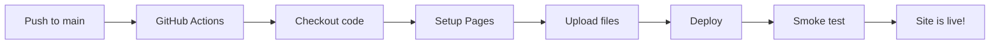

# CI/CD pipeline

```mermaid
graph LR
  A[Push to main] --> B[GitHub Actions]
  B --> C[Checkout code]
  C --> D[Setup Pages]
  D --> E[Upload files]
  E --> F[Deploy]
  F --> G[Smoke test]
  G --> H[Site is live!]
```
